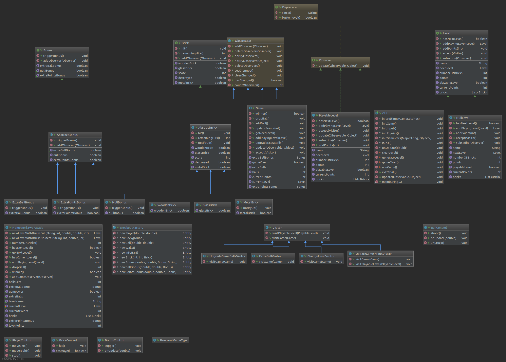

# cc3002-breakout
Tarea 3 CC3002 - Breakout

Implementación de Interfaz Gráfica para Juego BreakOut

Autor: José Astorga 
       Juan Pablo Silva (Código Base de HomeWorkTwoFacade y BigTest2)

### Instalación y Ejecución

Se desarrollo utilizando IntelliJ como proyecto Maven. 
Para utilizarlo simplemente descargar (git clone o download) y abrir como proyecto en IntelliJ. 

Para jugar: Ejecutar gui.GUI.

### Como Jugar
Destruye todos los ladrillos! y aprovecha de tomar todos los bonus frutales, Sandias otorgan puntos automáticamente y las Naranjas te entregan una nueva bola para que puedes acabar con el nivel actual más rápidamente.
Keys:
	- N:  Para añadir niveles. Debes añadir los niveles a jugar manualmente, una vez que el juego haya acabado no podrás seguir añadiendo niveles.
	- Espacio: Para iniciar el movimiento de la Bola y Movimiento especial cuando bola se encuentra estancada horizontalmente
	- A y D para desplazarse horizontalmente, te puedes mover siempre que haya al menos una bola en juego :)
 
### Detalles de Implementación

#### Features Implementadas

Se implementar 2 features: La creación de Bonus y añadir sonidos a las colisiones.

En el caso de los sonidos, se añadieron sonidos a las colisiones de la pelota con los diferentes ladrillos, con un sonido diferente para cada ladrillo, además de una explosión cuando se rompe alguno de los ladrillos. Se añade un sonido de rebote cuando la pelota rebota con el jugador, cuando se activa un bonus, cuando se inicia un nuevo nivel, y música de fondo. 

En el caso de los bonus, se añadieron 2 bonus al romper un ladrillo:
- Se tiene un 3% de probabilidad de activar el bonus de puntos extra, se añaden entre 5000 a 50000 (de manera random) puntos inmediatamente al puntaje total. 
- Se tiene un 5% de probabilidad de activar el bonus de bola extra, se añade una bola extra para superar el nivel actual (se elimina al pasar de nivel).

Ambos bonus se lanzan al romper un ladrillo, pero el jugador debe atraparlos para activarse efectivamente, el bonus de puntos es una naranja y el de bola extra una sandía. 

#### Cambios versión anterior:
Se trabajó sobre el código propio realizado para la tarea 2, pero se realizaron una serie de mejoras de acuerdo a la necesidad de gui y de los comentarios realizados en clases:

- Se cambio VisitorPattern: Ahora no se visitan Bricks, estos crean los visitors que se envian a sus observers (Lvl y Game)
- UpdateGameVisitor se dividió en 2 Visitors diferentes: UpdateGamePointsVisitor y UpgradeBallsVisitor. 
- Level mantiene una cuenta de los puntos obtenidos en ese nivel y notifica a Game cuando se termina el nivel. 
- Se implementó un nuevo paquete dentro de logic: Bonus, que son la representación lógica de los bonus antes mencionados, además junto con esto se creó el ExtraBallVisitor para actualizar Game.
- Se añadieron métodos a game y facade para compatibilizar con los Bonus.

#### Bugs:

- Hay momentos que la bola queda rebotando infinitamente de manera horizontal, no pude solucionarlo modificando los parámetros de la física de los elementos ni identificando la situación. Por lo que implementé una medida parche. Cuando la pelota quede horizontal, el jugador podrá apretar espacio para entregarle un movimiento en vertical (este movimiento no tiene efecto cuando la bola no esta atrapada).

#### Patrones Utilizados:
Se aplicaron los siguientes patrones de diseño:

- NullPatern: Se implementa una lista enlazada en los niveles (cada nivel contiene una referencia al siguiente), para lo cual es necesario implementar un NullLevel que se utiliza como último elemento de la lista enlazada. Además se implementa en la creación de Bonus, ya que un game se inicializa con NullBonus en sus bonus.

- VisitorPattern: Se implementa Visitor para poder añadir nuevos métodos de manera no instrusiva en los objetos. Se crea la clase Abstracta Visitor, el cual puede visitar Bricks, Levels y Games (ya que se utilizan para actualizar el estado del juego con ellos). En particular se implementan los Visitor GameUpdateVisitor, el cual visita bricks que hayan sido golpeados y actualiza la información del juego, y el CheckLevelOverVisitor que visita un nivel para checkear si ha terminado. 

- ObserverPattern: Se utiliza el ObserverPattern para mantener actualizado la información del juego. Se implementa como observadores Level, que observa a los ladrillos ( y el cual es actualizado cada vez que uno es golpeado ) y Game que observa al nivel actual ( para mantener actualizada la información del juego, además de checkear si el nivel termina), además se añade que Game es Obervado por GUI, con la idea de mantener actualizada la información desplegada en la interfaz Gráfica.

- Facade: Se utiliza el patrón facade para ocultar la complejidad del juego a un cliente que lo desee utilizar.

#### Packages:

- gui: Interfaz Gráfica del Juego.
	- GUI: Controla el flujo del juego 
	- BallControl: Controlador de Ball
	- BonusControl: Controlador de Bonus
	- BreakoutFactory: Fabrica de Entidades
	- BreakoutGameType: Tipos de Entidades en el Juego
	- BrickControl: Controlador de Brick
	- PlayerControl: Controlador de Player

- facade: Fachada para ocultar la complejidad del Juego.

- controller: Controlador del Juego
	- Game: Control del juego.

- logic: Contiene toda la lógica del juego (Módelo).
	- logic.bricks: 
		- Brick (Interface)
		- AbstracBrick: Implementación abstracta de Brick
		- GlassBrick 
		- MetalBrick
		- WoodenBrick
	
	- logic.level
		- Level (Interface)
		- PlayableLevel: Implementación de Level.
		- NullLevel: Implementación Nula de Level.
	
	- logic.bonus
		- AbstractBonus
		- Bonus
		- ExtraBallBonus
		- ExtraPointsBonus
		- NullBonus

- visitor: Clase Abstracta de Visitor.
	- ChangeLevelVisitor: Visitor para avanzar Game en un nivel.
	- ExtraBallVisitor: Visitor para añadir una bola extra a Game.
	- UpdateGamePointsVisitor: Visitor para actualizar puntos de Game y Level actual.
	- UpgradeGameBallsVisitor: Visitor para actualizar balls de Game.

#### Texturas y Efectos de Sonido

Todas las texturas y sonidos son de dominio público excepto por la música (CC v.4), a continuación sus fuentes:

##### Texturas: 

- WoodenBrick: [source](https://opengameart.org/content/wood-texture-tiles)
- GlassBrick: [source](http://freeseamlesstexture.blogspot.com/2014/03/glass-brick-seamless-texture.html)
- MetalBrick:[source](https://opengameart.org/content/free-metal-texture-creation-set-02)
- Bonus: Frutas -> [source](https://opengameart.org/content/simple-fruits)

##### Sonidos: 
- Hit Bricks y Bounce Player:  [source](https://opengameart.org/content/512-sound-effects-8-bit-style) 
- Break Brick: [source](https://opengameart.org/content/8-bit-explosions-1)
- Musica: BossTheme by tcarisland [source](https://opengameart.org/content/boss-theme-1) [licencia](https://creativecommons.org/licenses/by/4.0/)

#### Diagrama UML

### Doc
Documentación javaDoc en directorio [/doc](/doc)
