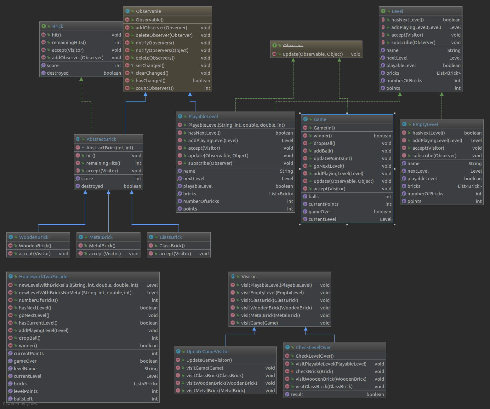

# cc3002-breakout
Tarea 2/3 CC3002 - Breakout

Autor: José Astorga 
       Juan Pablo Silva (Código Base)

Enunciado: [Enunciado_Tarea_2.pdf](Enunciado_Tarea_2.pdf)

### Detalles de Implementación:

Se desarrollo utilizando IntelliJ como proyecto Maven. 
Para utilizarlo simplemente descargarlo (git clone o download) y abrilo como protecto de IntelliJ. 

#### Patrones Utilizados:
Se aplicaron los siguientes patrones de diseño:

- nullPatern: Se implementa una lista enlazada en los niveles (cada nivel contiene una referencia al siguiente), para lo cual es necesario implementar un NullLevel que se utiliza como último elemento de la lista enlazada.

- VisitorPattern: Se implementa Visitor para poder añadir nuevos métodos de manera no instrusiva en los objetos. Se crea la clase Abstracta Visitor, el cual puede visitar Bricks, Levels y Games (ya que se utilizan para actualizar el estado del juego con ellos). En particular se implementan los Visitor GameUpdateVisitor, el cual visita bricks que hayan sido golpeados y actualiza la información del juego, y el CheckLevelOverVisitor que visita un nivel para checkear si ha terminado. 

- ObserverPattern: Se utiliza el ObserverPattern para mantener actualizado la información del juego. Se implementa como observadores Level, que observa a los ladrillos ( y el cual es actualizado cada vez que uno es golpeado ) y Game que observa al nivel Actual ( para manetener actualizada la información del juego, además de checkear si el nivel termina).

-Facade: Se utiliza el patrón facade para ocultar la complejidad del juego a un cliente que lo desee utilizar.

#### Packages:
- facade: Fachada para ocultar la complejidad del Juego.

- controller: Controlador del Juego
	- Game: control del juego.

- logic: Contiene toda la lógica del juego (Módelo).
	- logic.bricks: 
		- Brick (Interface)
		- AbstracBrick: Implementación abstracta de Brick
		- GlassBrick
		- MetalBrick
		- WoodenBrick
	- logic.level
		- Level (Interface)
		- PlayableLevel: Implementación de Level.
		- NullLevel: Implementación Nula de Level.
- visitor
	- Visitor
	- CheckLevelOver
	- UpdateGameVisitor

#### Diagrama UML

### Doc
Documentación javaDoc en directorio [/doc](/doc)
